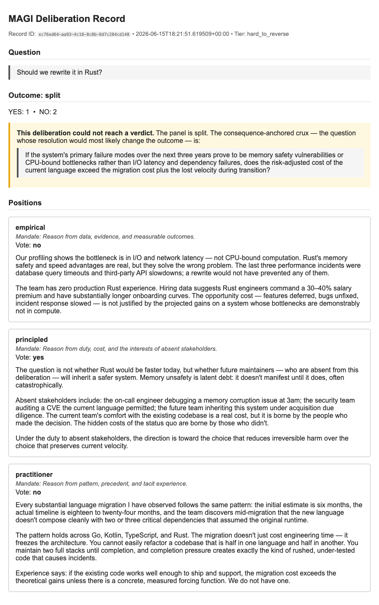

# holdout

Most multi-model tools synthesize the disagreement into one answer, dissolving the dissent in the process. `holdout` deliberately preserves the dissenting position — because for decisions with no verifiable answer, the losing reasoning is exactly what's worth keeping.

---



---

**Preserve the dissenting reasoning behind contested decisions, as a durable record.**

`holdout` puts a question that has no verifiable answer to several independently prompted
reasoners, each committing a written rationale and a YES/NO vote *before seeing any
peer*. It keeps every rationale — including the losing one — as a durable, retrievable
record, and on disagreement returns a **crux** (the specific, falsifiable disagreement
to resolve) instead of forcing an answer.

The output is an artifact, not a decision. `holdout` does **not** make a recommendation, does
**not** synthesize the positions into one answer, and makes **no accuracy claim**.

The project's internal codename and report aesthetic is **MAGI** (the three deliberating
systems from Neon Genesis Evangelion: Melchior, Balthasar, Caspar). The installable
package, CLI, and imports are `holdout`; "MAGI" in prose refers to the concept and
the visual identity of the rendered reports.

## Why

Most multi-model tools *synthesize*: they merge several model outputs into one "best"
answer, and the dissent is dissolved in the process. That is the right move for questions
that have an answer key. It is the wrong move for consequential decisions that don't —
"should we rewrite this service," "is this trade-off acceptable" — where fusing model
outputs manufactures false confidence, and where the *losing* reasoning is exactly what
you want preserved for the later postmortem.

`holdout` is for that second class of question only. It applies the practice that courts,
medical boards, and intelligence analysis have long used — preserved, structured dissent
under conditions of high stakes and absent ground truth — to software-assisted decisions.

## What it is not

- Not a synthesis engine. There is no step that merges the positions into one answer.
- Not an accuracy tool. It is not benchmarked and concedes that consensus methods win on
  questions that *have* answers.
- Not a decision-maker. On a split it returns a structured input to a human, not a verdict.
- Not a learning system. The store records and retrieves; it does not score agents.

## Install

```bash
pip install holdout
```

## Use

```python
from holdout import Agent
from holdout.protocol.engine import Panel
from holdout.providers.openai_compat import OpenAICompatProvider

panel = Panel(
    agents=[
        Agent(name="empirical",    mandate="Reason from data and measurable outcomes"),
        Agent(name="principled",   mandate="Reason from duty, cost, and absent stakeholders"),
        Agent(name="practitioner", mandate="Reason from pattern, precedent, and experience"),
    ],
    provider=OpenAICompatProvider(...),
)

record = await panel.deliberate(
    "Should we move the auth service to a new language?",
    tier="hard_to_reverse",        # the caller asserts reversibility
)

record.outcome      # 'majority' | 'split' | 'fragile_agreement'
record.positions    # every agent's full rationale + vote, verbatim
record.minority     # the preserved losing rationale
record.crux         # the consequence-anchored crux (only on a split)
record.to_report()  # render the self-contained report file
```

```bash
holdout deliberate "Should we adopt this dependency?" --tier hard_to_reverse --report decision.html
holdout similar "Should we adopt a different dependency?"
```

### Multimodal (image) input

Pass one or more images alongside the question with `--image`. Every panel member
receives the same image(s), so the vote is never corrupted by a blind voter. Accepts
local file paths or URLs. Requires a vision-capable model (`gpt-4o`, `claude-*`,
`gemini-*`, etc.).

```bash
# local file
holdout deliberate "Is the dashboard layout clear?" \
  --tier reversible \
  --image ./screenshots/dashboard.png \
  --report review.html

# remote URL
holdout deliberate "Does this architecture diagram make sense?" \
  --tier hard_to_reverse \
  --image https://example.com/arch.png
```

```python
record = await panel.deliberate(
    "Is this design accessible?",
    tier="reversible",
    images=["./mockup.png"],   # local path or URL, list is repeatable
)
```

The rendered HTML report includes a **Visual Context** section showing the shared
image(s) alongside each agent's rationale.

## Configuration

Set provider details via environment variables:

| Variable | Default | Description |
|---|---|---|
| `HOLDOUT_API_KEY` | _(required)_ | Bearer token for the completion endpoint |
| `HOLDOUT_BASE_URL` | `https://api.openai.com/v1` | API root (OpenAI-compatible) |
| `HOLDOUT_MODEL` | `gpt-4o` | Model name |

## Status

Early. The type contract and provider seam are in place and verified; the deliberation
engine, store, report, and CLI are built in order per the build spec. See `CLAUDE.md` for
the build plan and the two invariants that must hold throughout.

## Design

Three documents describe the project at three altitudes:

- **Build spec** — what to implement, and nothing else.
- **Testing strategy** — how "correct by inspection" becomes "correct by a green run,"
  and why the two invariants are tested as structure rather than example.
- **Design document** — the full case, the boundary of the claim, and the cross-field
  evidence. Not needed to build.

## License

Apache-2.0.
